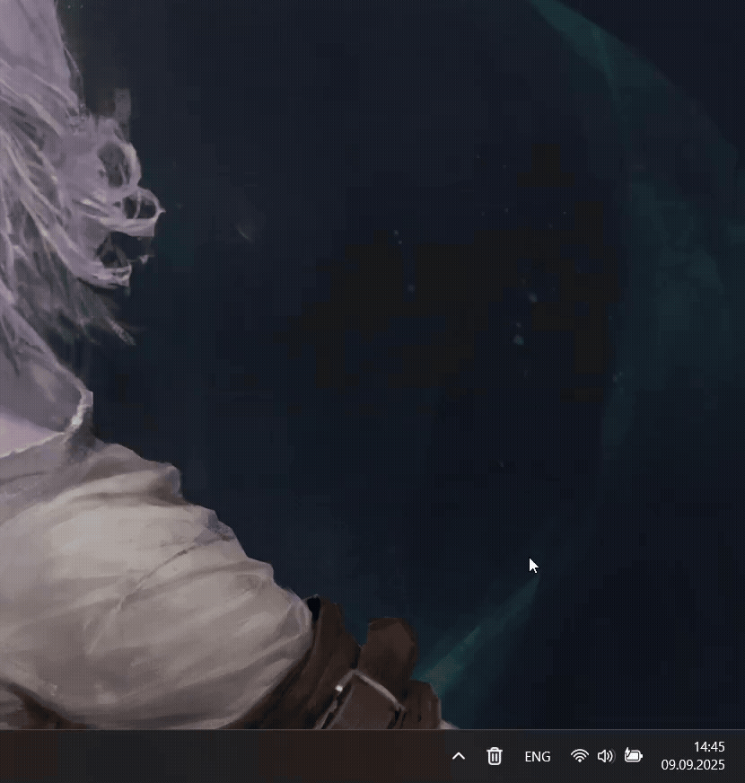

# QuickBin - Recycle Bin icon in the System Tray 

### About the application:
- View the recycle bin with a single click
- Empty the recycle bin with a double-click (can be disabled in settings)

The application is developed for the Windows platform.

### How it looks

